# HuaweiCloud ECS plugin
See the [中文文档](README_zh_CN.md) for Chinese readme.

# Table of contents

 * [Introduction](#introduction)
 * [Usage](#usage)
   * [Preconditions](#preconditions)
   * [start use](#start_use)

## Introduction <a id ="introduction"/>

This plug-in implements the automatic elastic scaling mechanism of jenkins slave nodes,When Jenkins is overloaded, call the HUAWEI CLOUD ECS API to create an instance, and automatically connect the created instance as a agent for Jenkins.When the load drops, the excess ECS instances will be terminated and released.

The following figure illustrates the operating mechanism of the plug-in:

 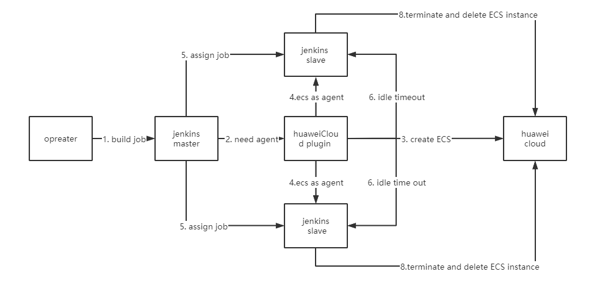

## Usage<a id="usage"/>

### Preconditions <a id="preconditions"/>

Before you start to use it, you should have the following conditions:

1. [HUAWEI CLOUD Account](https://auth.huaweicloud.com/authui/login.html?service=https://console.huaweicloud.com/ecm/#/login)

2. [HUAWEI CLOUD AccessKey/SecretKey](https://support.huaweicloud.com/devg-apisign/api-sign-provide-aksk.html)

   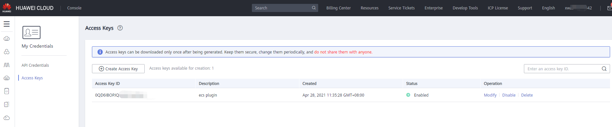

3. Create a key pair to establish an SSH connection

 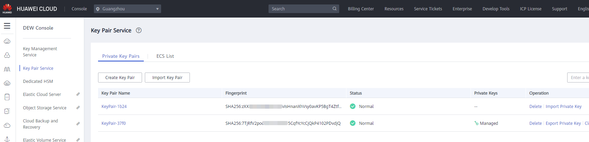

### Start Use <a id="start_use"/>

#### Step 1: Search and install the HUAWEI CLOUD ECS plug-in

Log in to the Jenkins console, navigate to the "manage jenkins"> "Plugin Manager"> "Available" menu; search for huaweicloud and install the plugin.

#### Step 2: Configure Clouds

After the installation is complete, navigate to the "Manage Jenkins"> "Manage Nodes and Clouds"> "Config Clouds" interface.

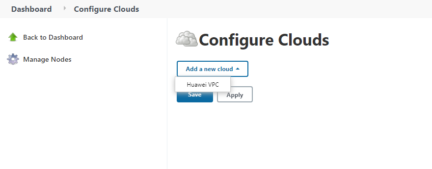

Click Huawei VPC to enter the cloud configuration page.

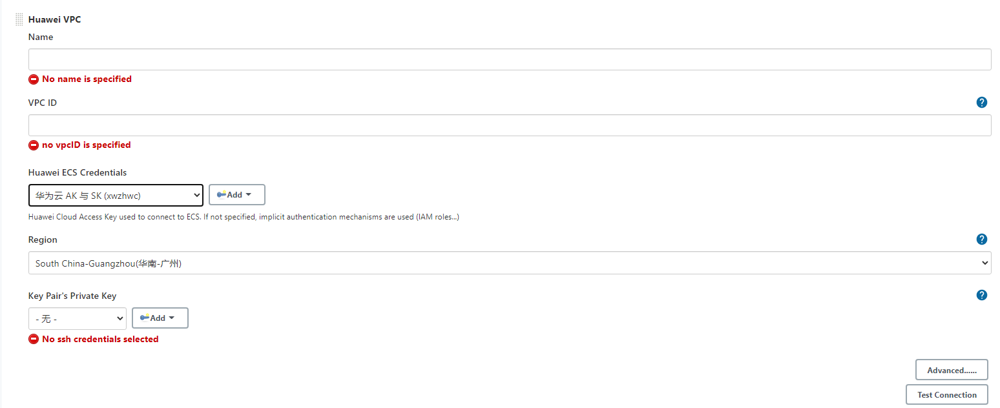

1. Configure the cloud Name (the name must be used to identify the cloud)

2. Configure virtual private cloud ID

   You need to specify the virtual private cloud (VPC) ID created on HUAWEI CLOUD. If there is no VPC, you need to create a VPC in the Alibaba Cloud console.

   

   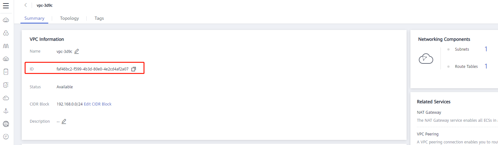

3. Configure Huawei ECS credentials

   Configure Huawei AK/SK to call Huawei Cloud API. Refer to [preconditions](#preconditions) to generate AK/SK.

   

4. Configuration region

   The region configuration is used to identify the region where the Huawei Cloud application is located. [Some regions are not supported by SDK restrictions](https://github.com/huaweicloud/huaweicloud-sdk-java-v3/blob/master/README_CN.md#32 -%E6%8C%87%E5%AE%9A-region-%E6%96%B9%E5%BC%8F-%E6%8E%A8%E8%8D%90-top). Just drop down to select an area.

5. Configure "key Pair's Private key". Refer to [preconditions](#preconditions) to create a key pair and configuration item corresponding help for configuration.

6. After completing all the above configurations, you can click the Test Connection button to verify that the configuration is correct.

   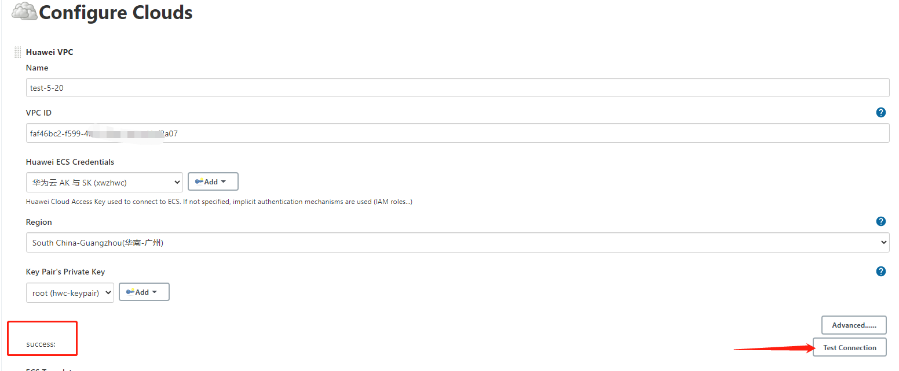

#### Step 3: Configure ECS template

This configuration item is used to configure the relevant attributes of the jenkins agent node, which will be used to create or delete an ECS instance.

1. Configure the mirror ID

   Choose Linux system mirroring on HUAWEI CLOUD (currently only supports Linux system).

   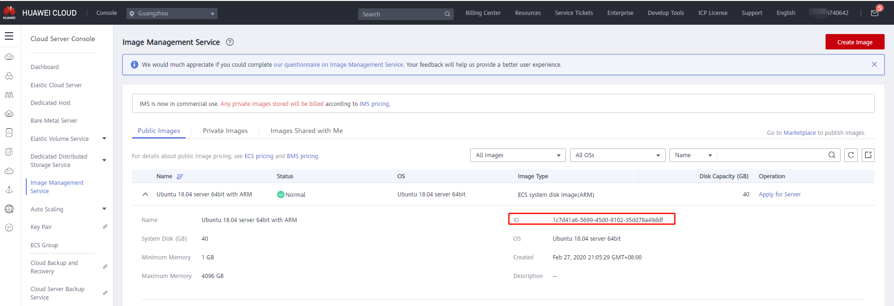

2. Configure Flavor ID

   Please refer to the "Instance Type and Specifications" section of ["Elastic Cloud Server Product Introduction"](https://support.huaweicloud.com/ecs/index.html) to select the required specifications. Example: s6.small.1.

3. Configure the available partition, drop down and select the corresponding AZ.

4. Configure the node label. When Usage selects "only build jobs with label expressions matching this node", please set a label to identify the node.

5. Configure the system disk type.

6. Set subnet ID

   The subnet ID must be VPC ID corresponding to the network ID created under the VPC, in UUID format; if you need to configure multiple subnet IDs, separate them with spaces.

7. Associate ECS public network IP

   Whether to create an elastic public network IP when creating an ECS instance and associate it with the instance. When selected, an elastic public network billed by traffic will be created.

8. Set idle timeout termination

   Set the time that the node is allowed to be idle, in minutes. When the idle time exceeds this time, the node will be released and the ECS instance will be deleted.

9. Set up initialization script (optional)

   The initialization script is a shell script that runs on the newly started follower node instance before Jenkins starts to start the follower node. This is also a good place to install other packages needed for building and testing.

After the configuration items are configured, you can click the "Test Create ECS" button to verify whether the configured content is incorrect when creating the ECS instance. If there are incorrect configuration items, the error content will be displayed:

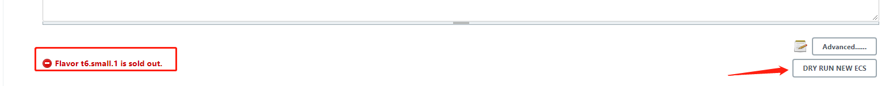

Otherwise, the prompt is successful:

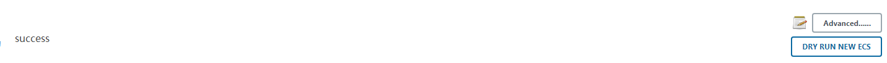

#### Step 4: Advanced option configuration

Non-required items, configure according to instructions and business scenarios.

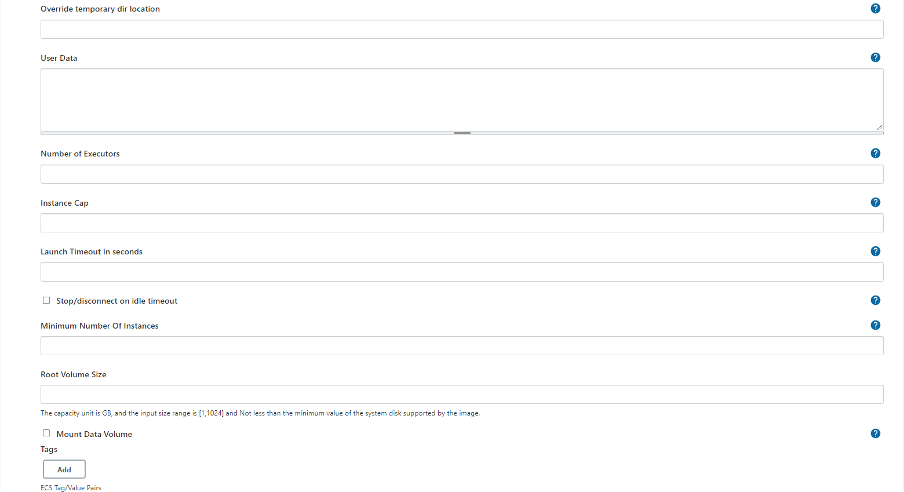

**Description:**

- Number of executors: The number of tasks executed concurrently on this node. It is recommended to set the number of CPU cores corresponding to the specifications.
- Instance Cap: the maximum number of Jenkins Agents (ECS) that can be created using the modified template. Suppose this is set to 5 and the number of currently running agents is 5. When Jenkins is overloaded, no new instances and agents will be created, and jenkins tasks will be queued.
- Stop connection when idle: When this option is selected, when the node is idle for a timeout, the ECS instance will be shut down and the agent node connection will be disconnected. When a new agent is required for the next overload, perform a boot operation on the shutdown instance and reconnect. "**Note: Shutdown will not completely end billing. Cloud hard drives and flexible public network services will be billed on demand.**"
- Minimum number of instances: The idle timeout check will only be performed when the number of instances exceeds this number.

#### Step Five: Save and execute the build

When all configuration items are configured, click the "Save" button. Note that the verification test is performed before saving.

Recommendation: Set the master node of executors to 0, that is, the master node does not execute the construction task.

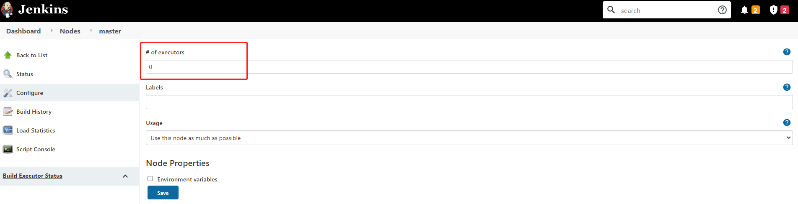

Next, you can create a "Freestyle project" and perform the build. Waiting for a while will start an agent to run the task. as the picture shows:

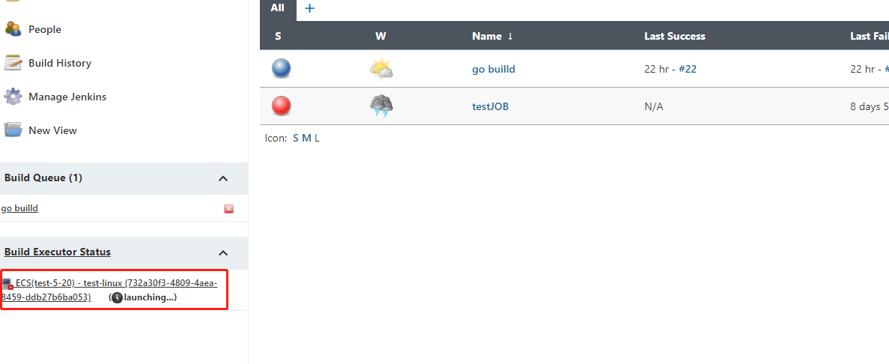

Successfully started：

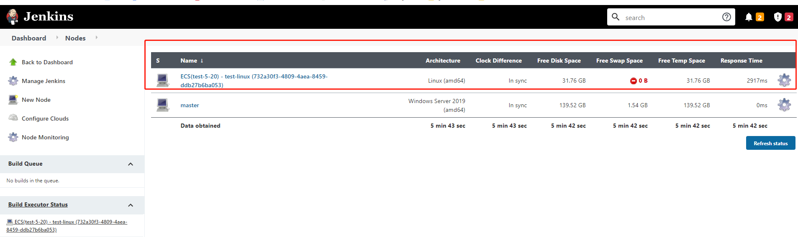

When the agent is successfully connected, the build will run on this agent：

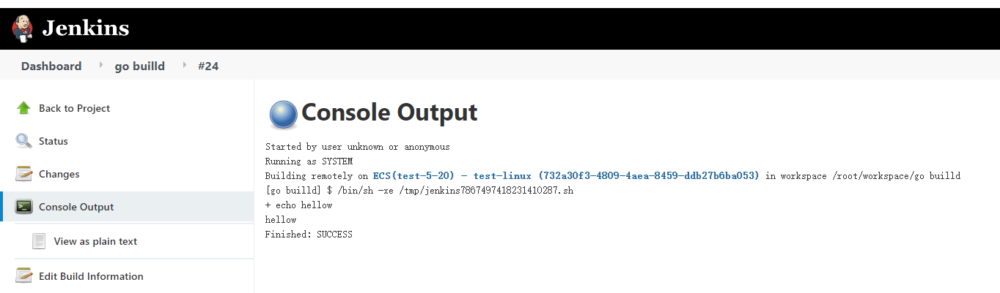

