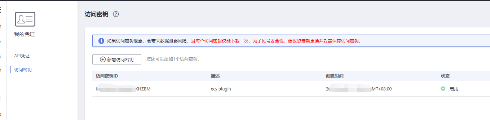
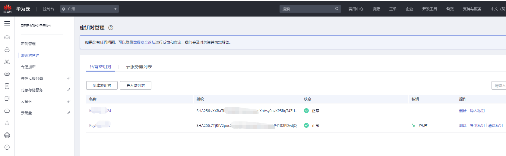
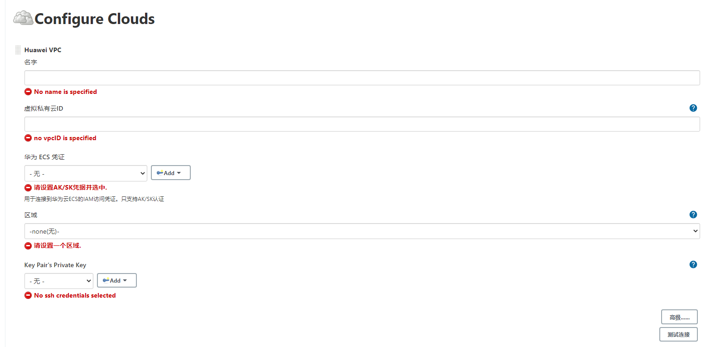
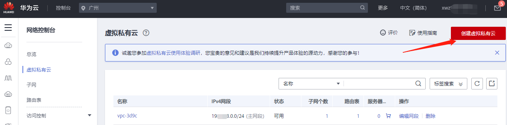
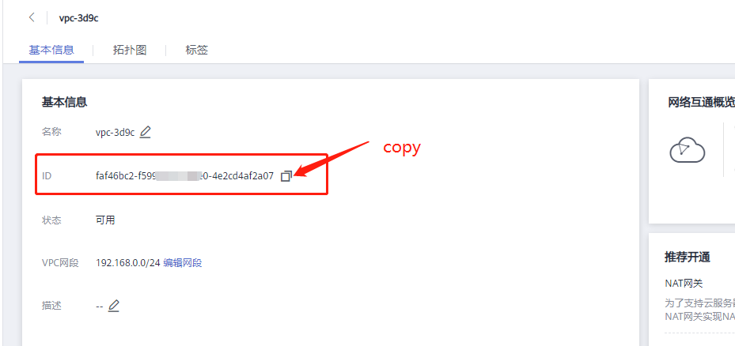
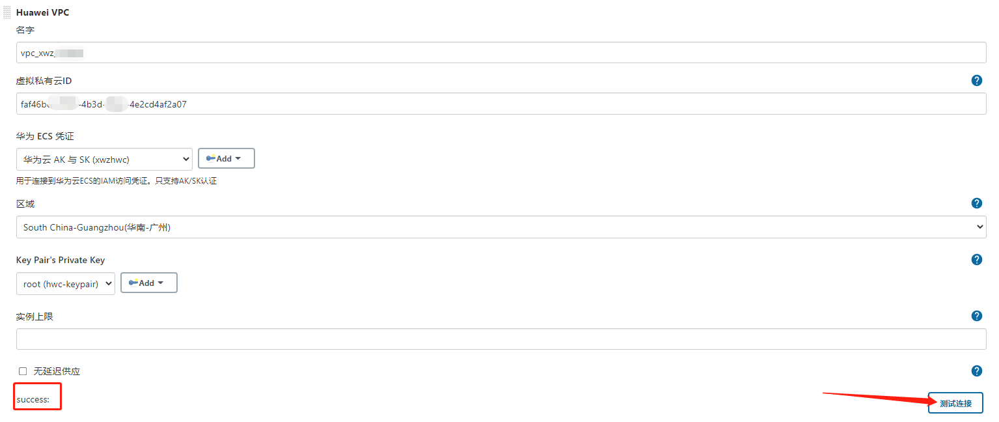
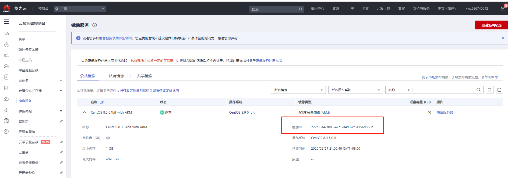
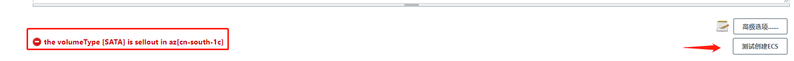
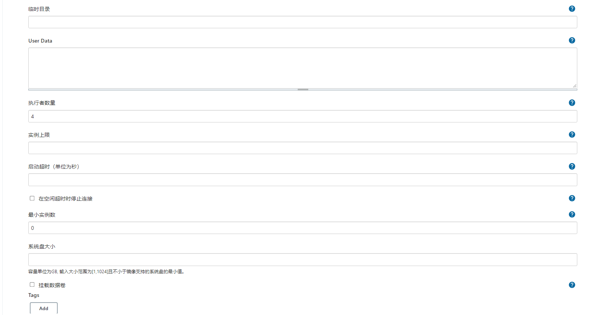

# HuaweiCloud ECS plugin

# 目录

 * [介绍](#introduction)
 * [用法](#usage)
   * [前置条件](#preconditions)
   * [开始使用](#start_use)

## 介绍 <a id ="introduction"/>

该插件实现jenkins从节点自动弹性伸缩机制，在jenkins超负载的时候调用华为云ECS API启动实例，并自动将创建的实例作为jenkins的代理进行链接。当负载下降时，多余的ECS实例将被终止并释放。

下图说明了该插件的运行机制：

 

## 使用<a id="usage"/>

### 前置条件 <a id="preconditions"/>

开始使用之前，您应具备以下条件：

1. [华为云账号](https://auth.huaweicloud.com/authui/login.html?service=https://console.huaweicloud.com/ecm/#/login)

2. [华为云 AccessKey/SecretKey](https://support.huaweicloud.com/devg-apisign/api-sign-provide-aksk.html)

   

3. 创建密钥对用于建立SSH连接（如果系统镜像中已配置ssh密钥则可以忽略该步骤）

 

### 开始使用 <a id="start_use"/>

#### 步骤一：搜索并安装华为云ECS插件

登录到Jenkins控制台，导航到“manage jenkins ” > "Plugin Manager" > "Available"菜单；键入并搜索huaweicloud,安装该插件。

#### 步骤二：配置Clouds

安装完成后，导航到 “Manage Jenkins” > "Manage Nodes and Clouds" > "Config Clouds"界面。

点击Huawei VPC 进入云配置页

1. 配置云“Name”（必须使用名称来标识云）

2. 配置私有云ID 

   需指定在华为云以创建的虚拟私有云（VPC）ID,如没有VPC，需在华为云控制台创建VPC。

   

   

3. 配置华为ECS凭据

   配置华为AK/SK用于调用华为云 API。参考[前置条件](#preconditions)生成AK/SK。

   

4. 配置区域

   区域配置用于标识华为云应用所在的区域，[受SDK限制有些区域暂不支持](https://github.com/huaweicloud/huaweicloud-sdk-java-v3/blob/master/README_CN.md#32-%E6%8C%87%E5%AE%9A-region-%E6%96%B9%E5%BC%8F-%E6%8E%A8%E8%8D%90-top)。下拉选择一个区域即可.

5. 配置“key Pair's Private key”。参考[前置条件](#preconditions)创建密钥对以及配置项对应帮助进行配置。

6. 完成以上所有配置以后，可以点击测试连接按钮验证配置是否正确。

   

#### 步骤三：配置ECS 模板

该配置项用于配置jenkins agent node相关属性，将使用这些配置项创建或删除ECS实例。

1. 配置镜像ID 

   在华为云上选择Linux系统镜像，(目前只支持linux系统)。

   

2. 配置规格ID

   请参见[《弹性云服务器产品介绍》](https://support.huaweicloud.com/ecs/index.html)的“实例类型与规格”章节选择需要的规格。例：s6.small.1

3. 配置可用分区，下拉选择对应AZ即可。

4. 配置节点标签，当Usage 选择为“only build jobs with label expressions matching this node”时请设置一个标签标识该节点。

5. 配置系统盘类型。

6. 设置子网ID

   子网ID必须为VPCID 对应VPC下创建的网络ID,UUID格式；如需配置多个子网ID以空格分隔。

7. 关联公网IP

   当创建ECS实例时是否创建弹性公网IP并与实例关联，当选中时，会创建按流量计费的弹性公网。

8. 设置空闲终止时间

   设置允许节点空闲的时间，单位为分钟，当空闲超过该时间，将释放节点并删除ECS实例。

9. 设置初始化脚本（可选）

   初始化脚本是在Jenkins开始启动跟随者节点之前在新启动的跟随者节点实例上运行的Shell脚本。 这也是安装构建和测试所需的其他软件包的好地方。

当配置项配置完成后可点击“测试创建ECS”按钮验证已配置内容在创建ECS实例时是否有误，如果存在错误配置项，会提示错误内容:

否则提示成功:

#### 步骤四：高级选项配置

非必填项，根据说明以及业务场景进行配置。

**说明：**

- 执行者数量：在该节点上并发执行的任务数，建议设置为对应规格的CPU核数。
- 实例上限：为可以使用改模板创建jenkins代理(ECS)的最大数。假设该置为5，当前在运行的代理数为5，则当jenkins超负载时不会再创建新的实例以及代理，jenkins任务将排队等待。
- 在空闲时停止连接：选中此选项时，当节点空闲超时时，将对ECS实例执行关机操作并断开代理节点连接。当下一次超负载需要新的代理时，对已关机的实例执行开机操作并重连。"**注意：关机并不会彻底结束计费，云硬盘，弹性公网任会按需计费。**"
- 最小实例数：实例数超过该数才会执行空闲超时检查。
- 远程用户为root用户且选中关联华为密钥对，系统镜像无需设置ssh密钥；否则需确保系统镜像中存在指定的远程用户并配置好ssh密钥

#### 步骤五：保存并执行构建

当所有配置项配置完毕，点击“Save”按钮即可。注意在保存之前进行验证测试。

建议：将主节点of executors设置为0，即主节点不执行构建任务。

接下来，你可以创建一个“Freestyle project”并执行构建。等待一段时间将会启动一个代理来运行该任务。如图所示：

启动成功：

当代理连接成功该构建就在此代理上运行：

